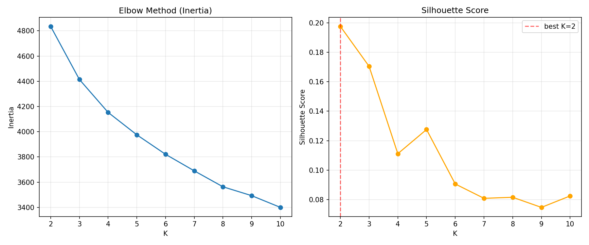
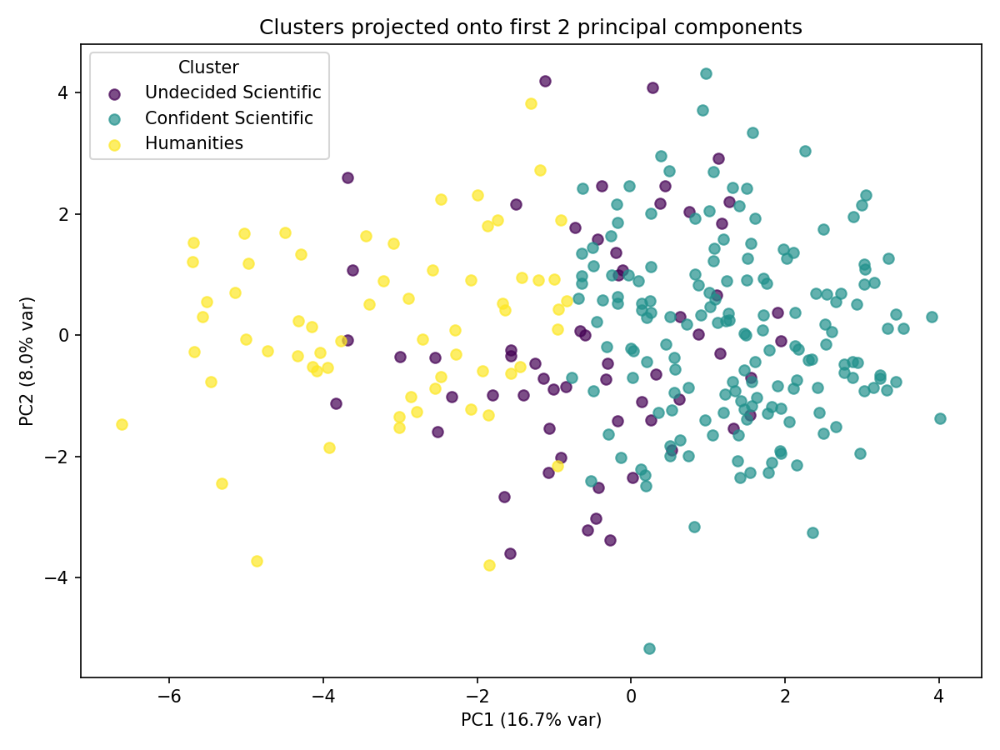
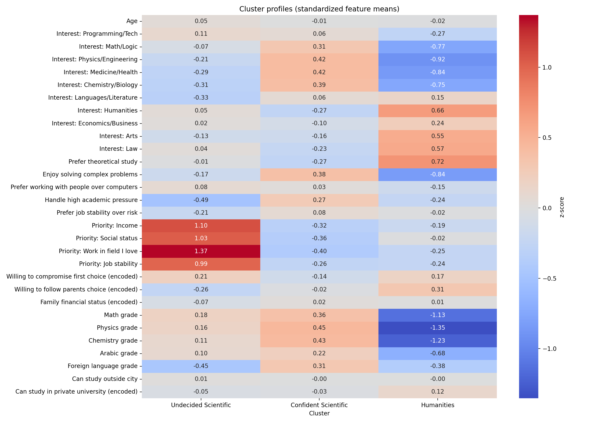

# Academic Advisor — University Major Recommendation System

A full machine learning pipeline that recommends university majors to Syrian high-school (بكالوريا) students, built on real survey data from **290 students**. The system clusters students by interests, personality, and priorities, then combines that with their actual grades and academic branch to produce a ranked, explainable set of major recommendations — plus a personalized weekly study plan for any subject standing between a student and their goal.

This isn't a toy clustering demo: majors are gated by real 2025–2026 Syrian university admission cutoffs, the clustering algorithm was chosen after formally comparing three candidates on stability and structure (not just picked by default), and the whole thing is exposed as an API with a working backend integration.

## Pipeline

The project is a five-stage pipeline, each stage a standalone script that reads the previous stage's output:

| Stage | Script | What it does |
|---|---|---|
| 1 | `clean_encode.py` | Cleans the raw survey export, validates and encodes ordinal answers (e.g. "can you study at a private university?") |
| 2 | `scale.py` | Selects the 20 features that actually drive clustering and standard-scales them (grades on a 0–100 scale and Likert 1–5 answers would otherwise be weighted unevenly) |
| 3 | `find_k.py` | Sweeps K = 2–10 for KMeans and picks the best K by silhouette score (not inertia alone, which always favors more clusters) |
| 4 | `clustering.py` | Fits the final KMeans model at the chosen K and attaches a cluster label to every student |
| 5 | `analyze.py` | Builds the human-readable cluster profiles, PCA visualization, and validation checks against students' actual stated major preferences |

`recommend.py` then sits on top of the fitted model to score a **new** student's answers in real time, and `api.py` exposes that as a FastAPI service.

## Methodology: Why K-Means

Rather than defaulting to K-means, three clustering algorithms were formally compared (`clustering_experiment_algorithms.py`):

- **K-Means** — silhouette 0.171, best of the three
- **Ward (hierarchical)** — silhouette 0.114, and produced a visibly unbalanced 130/133/27 split
- **Gaussian Mixture Model (diagonal covariance)** — silhouette 0.118, and seed-sensitive (mean ARI 0.820 across 12 random seeds, one run as low as 0.316 — a different local optimum, not the same clustering)

K-Means also won on stability: **mean ARI 0.990** across 12 random seeds and **0.976** across 20 bootstrap resamples, versus Ward's 0.501. It's also the only one of the three that supports classifying a brand-new student against fixed centroids in O(k) time without ever refitting on the full dataset — a hard requirement for the live recommendation API. Full writeup in `clustering_experiment_algorithms_justification.txt`.

The 20 clustering features themselves were also trimmed down from an original 30 using ANOVA F-score + PCA-importance ranking (`clustering_experiment.py` / `clustering_experiment_feature_ranking.csv`) — weak features were either dropped entirely or moved out of the clustering vector and turned into explicit rules in the recommendation engine instead (see below).

<p align="center">
  
</p>

<p align="center">
  
  
</p>

## The Recommendation Engine

`recommend.py` turns a student's cluster assignment and raw answers into a ranked recommendation, not just a cluster label:

- **Grade-based eligibility**, using real 2025–2026 Syrian university admission cutoffs (e.g. Medicine ≈ 92%, Engineering ≈ 83%), converted from the official out-of-2400/2200 point scale. A grade within 5 points of the cutoff is still counted as matched ("borderline"); one within 15 points becomes an **aspiration major** rather than being dropped outright.
- **Branch-aware grading** — Literary-branch students don't sit physics/chemistry exams in the real curriculum, so their average is computed over 3 subjects instead of 5, rather than letting an unstudied "0" wrongly crush their score.
- **Interest-first ranking** — every eligible major is ranked by the student's own interest score for that field (not just their grades), so the first recommendation is the one they're genuinely most drawn to; grade margin only breaks ties.
- **Personalized weekly study schedule** — for any subject holding a student back from an aspiration major, the engine builds a day-by-day weekly review plan (Sunday–Thursday evening blocks, longer weekend blocks), weighted toward the subjects that need the most work.
- **Curated teacher/channel suggestions** for weak subjects, sourced specifically for the Syrian bakalorya curriculum (most generic "best chemistry teacher" search results skew Egyptian and don't match the Syrian syllabus).
- **Exam-stage awareness** — once a student's grades are final (no more supplementary rounds), the engine stops suggesting study plans for gaps that can no longer close, and excludes rather than "aspirations" any major that needed more.

Every decision the engine makes is returned with a full explanation trail (`evaluations`, `priority_boosts`) — nothing is a black box.

## Tech Stack

- **Data processing & modeling:** Python, pandas, NumPy, scikit-learn (KMeans, StandardScaler, PCA, silhouette score)
- **Visualization:** matplotlib, seaborn
- **API:** FastAPI + Pydantic
- **Backend integration:** Laravel (PHP) — auth, submission storage, and a controller that calls the Python API

## Project Structure

```
Academic-Advisor/
├── clean_encode.py                 # Stage 1: clean + encode raw survey data
├── scale.py                        # Stage 2: select & scale clustering features
├── find_k.py                       # Stage 3: choose K via silhouette score
├── clustering.py                   # Stage 4: fit final KMeans model
├── analyze.py                      # Stage 5: cluster profiles + PCA + validation
├── clustering_experiment.py        # Feature-importance ranking (ANOVA F-score + PCA)
├── clustering_experiment_algorithms.py       # K-Means vs Ward vs GMM comparison
├── recommend.py                    # Inference: recommend majors for a new student
├── api.py                          # FastAPI wrapper around recommend.py
├── laravel-backend/                # Drop-in Laravel controllers/models/migrations
│   └── README.md                   # Setup instructions for the backend
├── دليل_بناء_الباك_اند_Laravel.md   # Full Laravel integration guide (Arabic)
└── *.png / *.csv                   # Generated charts and intermediate data
```

## Running It

```bash
pip install pandas numpy scikit-learn matplotlib seaborn fastapi uvicorn

# Run the pipeline stages in order (only needed to reproduce the model from raw data)
python clean_encode.py
python scale.py
python find_k.py
python clustering.py
python analyze.py

# Try the recommendation engine directly
python recommend.py

# Or serve it as an API
uvicorn api:app --reload --port 8000
```

`scaler.pkl`, `kmeans_model.pkl`, and `feature_columns.pkl` are already included, pre-fitted — `recommend.py` and `api.py` both work out of the box without re-running the pipeline.


## Data

Survey responses were collected from 290 real Syrian third-year secondary school (بكالوريا) students, covering their academic branch, grades, interests, personality traits, and priorities. The raw dataset is included for reproducibility; no personally identifying information is collected by the survey.  
